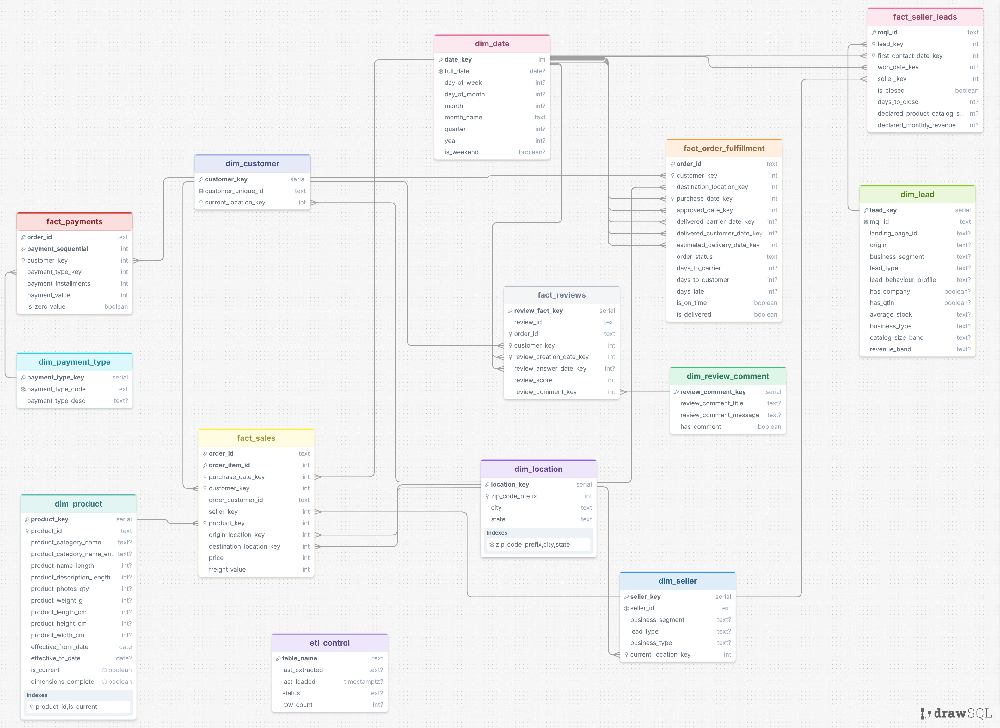

# Olist Data Warehouse

A production‑ready Kimball‑style data warehouse for the Brazilian Olist e‑commerce
dataset, built with PostgreSQL and an incremental Python ETL pipeline.

## DWH Modeling


## Architecture

- **Source**: SQLite OLTP database (Olist dataset from Kaggle)
- **Target**: PostgreSQL data warehouse
- **Model**: Kimball star schema with conformed dimensions
- **Pipeline**: Batch incremental, idempotent, with error handling and data quality checks

## Repository Structure

```
olist-dwh/
├── README.md
├── requirements.txt
├── docs/
│   ├── architecture.md
│   ├── dwh_schema.jpg
│   └── assumptions_and_tradeoffs.md
├── sql/
│   ├── create_schema.sql
│   ├── analytical_queries.sql
│   └── data_quality_checks.sql
├── etl/
│   ├── __init__.py
│   ├── config.py
│   ├── pipeline.py
│   ├── extract.py
│   ├── transform.py
│   ├── load_dimensions.py
│   ├── load_facts.py
│   └── utils.py
└── tests/
    ├── __init__.py
    └── test_pipeline.py
```

## Quick Start

1. **Set up PostgreSQL** and create a database `olist_dwh`.
2. **Install Python dependencies**:
   ```bash
   pip install -r requirements.txt
   ```
3. **Configure database connections** in `etl/config.py`.
4. **Run the ETL pipeline**:
   ```bash
   cd etl
   python pipeline.py
   ```
5. **Run sample analytical queries** from `sql/analytical_queries.sql`.

## Features

- **Five star‑schema fact tables**: sales, order fulfillment, payments, reviews, seller leads
- **Seven conformed dimensions**: date, location, customer, seller, product, payment type, lead
- **Type‑2 slowly‑changing dimension** for products
- **Type‑1 dimensions** for customers, sellers, leads
- **Incremental loading** with watermark tracking
- **Data quality handling**: deduplication, orphaned records, missing values
- **Idempotent reruns**
- **Performance indexes** on all foreign keys and filter columns

## Key Design Decisions

- **Separate fact tables** per business process to preserve correct grain.
- **Geolocation table dropped** – coordinates were too inaccurate; location derived from customer/seller ZIP codes.
- **Degenerate dimensions** for `order_id`, `review_id`, etc.
- **“Unknown” dimension members** for missing references.
- **No seller key in order‑fulfillment fact** – avoids grain inflation.

## Documentation

See the `docs/` folder for detailed architecture, data model, and trade‑off analysis.
