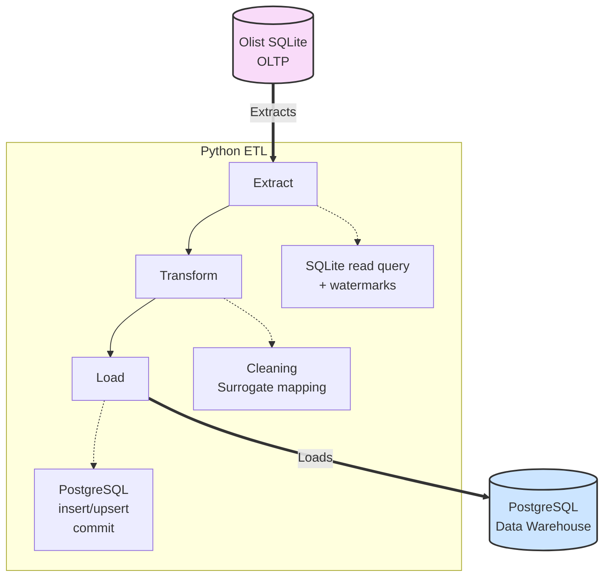

# Architecture

## Overview

The data warehouse follows the **Kimball dimensional model**, designed as a star
schema with conformed dimensions. The target database is **PostgreSQL**, and the
ETL pipeline is implemented in **Python** using `psycopg2` for direct, efficient
SQL execution.

The source system is a static SQLite snapshot of the Olist e‑commerce marketplace.
The pipeline is **incremental by design** – it can process only new or changed rows
based on timestamps and watermarks, making it suitable for both the provided static
dataset and a hypothetical live source.

## High‑Level Architecture Diagram

## Technology Stack

- **Source:** SQLite (provided Olist dataset)
- **Target:** PostgreSQL
- **ETL Language:** Python 3
- **Database Driver:** `psycopg2-binary` (low‑level, high‑performance)
- **Scheduling:** Manual / cron (pipeline is idempotent and safe to re‑run)
- **Testing:** Pytest

## Data Flow

1. **Extract:**
   - Read from source SQLite file.
   - Use *watermark timestamps* stored in the target `etl_control` table to
     select only new or changed rows (for order‑based facts, the watermark is
     `order_purchase_timestamp`; for reviews, `review_creation_date`; for leads,
     `first_contact_date`).
   - For the static snapshot, the first run sets watermarks to `'1900-01-01'` and
     loads all data.

2. **Transform:**
   - Clean city names (normalise ASCII‑accented characters).
   - Map natural keys (`customer_id`, `seller_id`, `product_id`) to surrogate
     keys from the dimension tables.
   - For SCD Type2 products, select the version active at the time of the
     transaction.
   - Look up text strings to find or insert their unique surrogate key in `dim_review_comment`.
   - Flag zero‑value payments and normalise `payment_installments` (0 → 1).
   - Map orphaned `seller_id` in `leads_closed` to a special “Unknown” seller
     row (`seller_key = -1`).

3. **Load:**
   - Dimensions are loaded first (static → Type1 → Type2) to ensure all
     surrogate keys exist before fact loading.
   - Fact tables are loaded using `INSERT ... ON CONFLICT DO NOTHING` for
     idempotent inserts (except `fact_order_fulfillment`, which uses an
     accumulating snapshot approach with `ON CONFLICT ... DO UPDATE` to capture
     order status changes).
   - Watermarks are updated after each fact load.

## Dimensional Modeling Approach

The warehouse is designed around **five business processes**, each represented
by its own fact table with a clearly declared grain:

| Business Process | Fact Table | Grain |
|------------------|------------|-------|
| Sales & Order Fulfillment (item level) | `fact_sales` | One row per order item |
| Order Fulfillment (delivery performance) | `fact_order_fulfillment` | One row per order |
| Payments | `fact_payments` | One row per payment transaction |
| Customer Reviews | `fact_reviews` | One row per review (deduplicated) |
| Seller Acquisition | `fact_seller_leads` | One row per marketing qualified lead |

**Conformed dimensions** are shared across facts:

- `dim_date` – Role‑played for purchase, approval, shipping, delivery, etc.
- `dim_location` – Built from cleaned customer/seller ZIP codes; used for origin
  and destination in logistics facts.
- `dim_customer` – Type1 (current snapshot); transaction‑time location is stored
  in the facts. Natural key is `customer_unique_id`.
- `dim_seller` – Type1; enriched with business attributes from `leads_closed`.
- `dim_product` – Type2; tracks category and physical attribute changes.
- `dim_payment_type` – Static lookup.
- `dim_lead` – Type1; holds lead attributes and discrete qualitative bands (e.g. `catalog_size_band`, `revenue_band`).
- `dim_review_comment` - Static lookup; holds the raw textual contents for reviews without keeping bulky text in the fact tables.

### Slowly Changing Dimension Strategies

| Dimension | SCD Type | Rationale |
|-----------|----------|-----------|
| `dim_date` | 0 | Immutable calendar |
| `dim_location` | 0 | Static geographic data |
| `dim_payment_type` | 0 | Fixed domain |
| `dim_review_comment` | 0 | Unique combinations of text entries |
| `dim_customer` | 1 | Overwrite on change; current address only |
| `dim_seller` | 1 | Overwrite on change; current business info |
| `dim_lead` | 1 | Latest lead attributes only |
| `dim_product` | 2 | Historical category & dimension changes matter |

## Pipeline Design

### Idempotency & Fault Tolerance

- Fact tables use `PRIMARY KEY` constraints and `ON CONFLICT DO NOTHING` to
  guarantee no duplicate rows on re‑run.
- Dimension upserts use `ON CONFLICT (natural_key) DO UPDATE` – safe to run
  multiple times.
- Watermarks are updated in the same transaction as the fact load; if the
  transaction fails, the watermark is not advanced.
- All operations are wrapped in Python `try/except` blocks; on failure, the
  PostgreSQL transaction is rolled back and the error is logged.

### Incremental Loading

- The `etl_control` table stores the last extracted timestamp per fact table.
- Each extraction compares source timestamps against the stored watermark.
- Works for static data (first run loads everything) and for future change‑data‑
  capture sources.

### Scalability

- The ETL processes data in configurable batch sizes (not strictly necessary for
  ~100k rows, but the pattern is in place).
- `executemany()` is used for bulk inserts.
- Indexes on all foreign keys and common filter columns (e.g., `purchase_date_key`)
  ensure fast aggregations.
- Partitioning was not implemented because the data volume (~500k fact rows)
  does not warrant it. The design allows adding range‑partitioning on `date_key`
  later if volumes grow.

## Performance Optimization

- **Indexes:** Every foreign key is indexed, plus composite indexes on date keys
  for the largest facts.
- **Pre‑computed measures:** `days_to_carrier`, `days_late`, `is_on_time` are
  calculated once during ETL, making analytical queries fast and simple.
- **Degenerate dimensions:** Identifiers like `order_id`, `review_id` are stored
  directly in facts, avoiding unnecessary joins to empty dimension tables.
- **Denormalised location:** `destination_location_key` and `origin_location_key`
  are placed directly on sales and fulfillment facts, removing the need to hop
  through customer/seller dimensions for most geographic queries.

## Data Quality Handling

- **Handling Duplicate `review_id`** – Allowed naturally into the sequence with surrogate text comments via `dim_review_comment`.
- **Orphaned sellers in `leads_closed`** – Mapped to a dedicated “Unknown” seller
  row (`seller_key = -1`) to avoid FK violations and data loss.
- **Missing product categories** – Inserted manually into the source translation
  table before loading.
- **Zero‑value payments** – Flagged with `is_zero_value` boolean; voucher
  payments are considered legitimate.
- **Missing product dimensions** – Flagged with `dimensions_complete` boolean;
  products are still loaded and available for revenue analysis.
- **Missing order approval timestamps** – Orders that are canceled/created are
  excluded from the fulfillment fact. Delivered orders with NULL approval get
  an “Unknown” date key (`-1`).

## Monitoring & Logging

- Python’s `logging` module writes timestamps and messages for each step.
- Data quality checks (in `sql/data_quality_checks.sql`) can be run after each
  load to assert row counts, duplicate absence, and referential integrity.

## Key Assumptions & Trade‑offs

- **Assumption:** Customer and seller ZIP codes at load time represent the
  historical shipping addresses for all orders. The source does not maintain
  an address history.
- **Assumption:** The `geolocation` table coordinates are too inaccurate for
  meaningful distance calculations and have been dropped; location analysis
  is performed at the city/state level using `dim_location`.
- **Trade‑off:** No seller key in `fact_order_fulfillment` – seller‑level
  delivery analysis requires a join to `fact_sales`. This keeps the order‑level
  grain pure.
- **Trade‑off:** SCD Type1 for customers/sellers – we sacrifice historical
  location tracking for entity simplicity, compensated by transaction‑time
  location keys in the fact tables.
- **Trade‑off:** Pre‑computed delivery metrics add a slight ETL cost and storage
  but dramatically improve query performance for the most common business questions.
